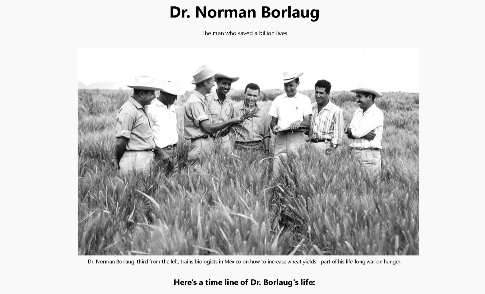
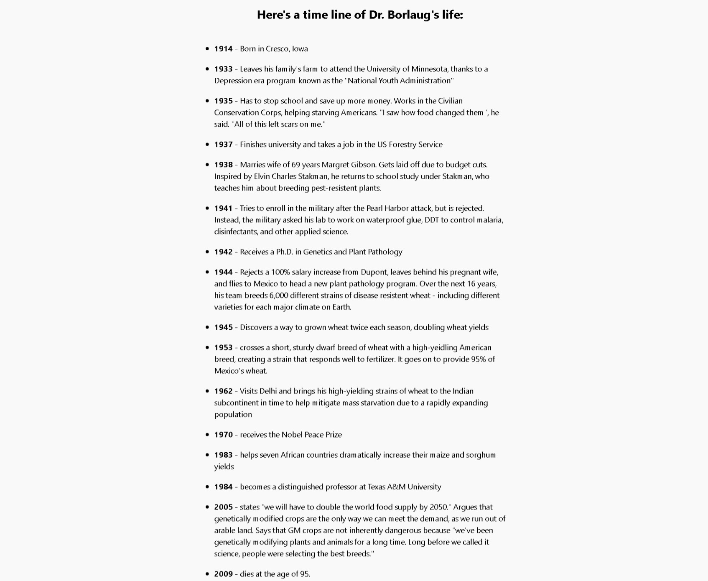
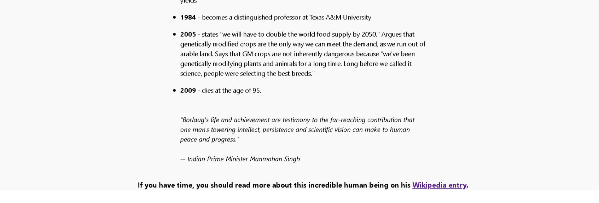
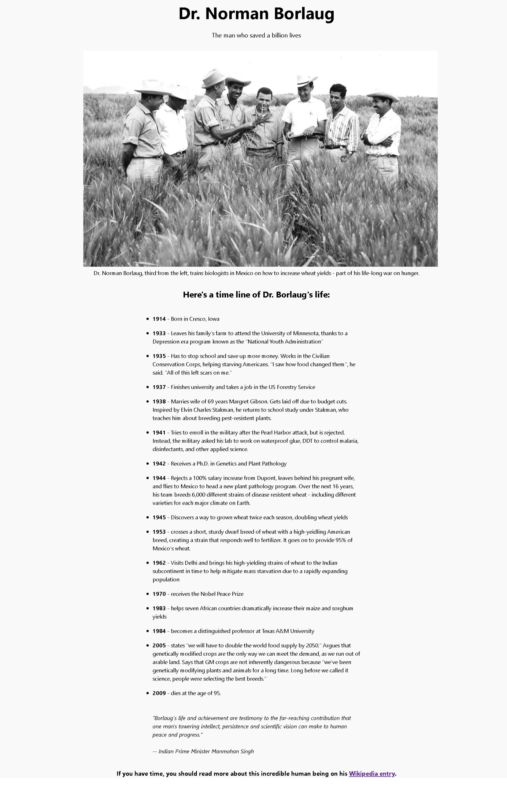

# Tribute Webpage 🌟

This repository contains the files for a tribute webpage that I created as part of my FreeCodeCamp certification. The webpage is dedicated to paying tribute to a person of great significance, and it showcases their accomplishments, contributions, and impact on society. The design of the webpage is simple yet elegant, aiming to provide a visually pleasing and informative experience for visitors.

## 📷 Screenshots

Here are some screenshots of the tribute webpage:

1. **Intro Image:**
   

2. **Webpage Screenshot 1:**
   

3. **Webpage Screenshot 2:**
   

4. **Webpage Screenshot 3:**
   

## 📜 Table of Contents

- [Introduction](#introduction)
- [Demo](#demo)
- [Features](#features)
- [Usage](#usage)
- [Conclusion](#conclusion)

## Introduction

The tribute webpage is an interactive platform that celebrates the life and accomplishments of an influential figure. The webpage serves as a means to educate, inspire, and remember the contributions made by the person being honored. It combines visually appealing elements with informative content to engage the visitors and create a memorable experience.

## Demo 🎉

You can check out the live demo of the tribute webpage [here](https://baby-laala.github.io/tributepage/).

## Features

The tribute webpage includes several key features that enhance its functionality and user experience:

1. 🖼️ **Responsive Design**:
   The webpage is built with a responsive design, ensuring that it adapts and displays appropriately across various devices and screen sizes. Whether accessed from a desktop computer, laptop, tablet, or smartphone, the webpage will maintain its visual integrity and provide optimal user interaction.

2. 📝 **Engaging Content**:
   The tribute webpage presents engaging and informative content about the person being honored. It includes a brief biography, notable achievements, and a summary of their impact on society. Visitors can gain valuable insights into the life and contributions of the individual, fostering a deeper understanding and appreciation.

3. ✨ **Visual Enhancements**:
   To create an engaging and visually appealing experience, the webpage incorporates images, graphics, and typography. The design elements are carefully selected to complement the content and evoke a sense of admiration and respect for the person being celebrated.

4. 🔗 **External Links**:
   The tribute webpage provides external links to relevant sources, such as books, articles, or videos, allowing visitors to further explore the life and work of the honored person. These links serve as valuable resources for those interested in delving deeper into the subject matter.

## Usage

To use the tribute webpage, simply open the HTML file in a web browser of your choice. The webpage is designed to be self-contained, requiring no additional dependencies or installations.

Feel free to customize and modify the webpage to suit your specific needs. You can update the content, replace the images, or even enhance the design to reflect your personal style or the person you wish to pay tribute to.

## Conclusion

The tribute webpage is a meaningful project that showcases the accomplishments and impact of an influential individual. It offers an immersive experience through its engaging content, visual enhancements, and intuitive design. By utilizing this webpage, you can create a compelling tribute to someone you admire while honing your web development skills.

Please note that the tribute webpage was created as part of the FreeCodeCamp certification process and is intended for educational purposes.
